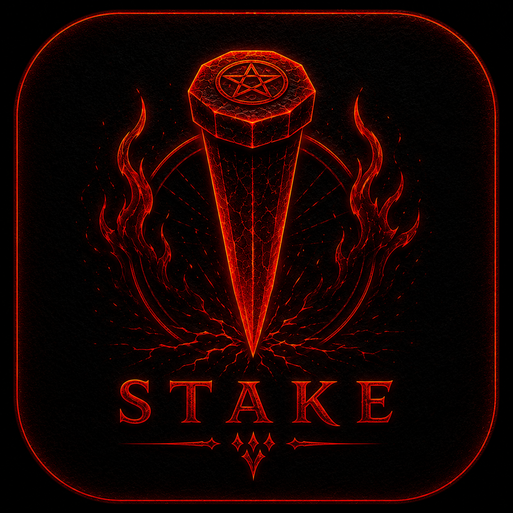
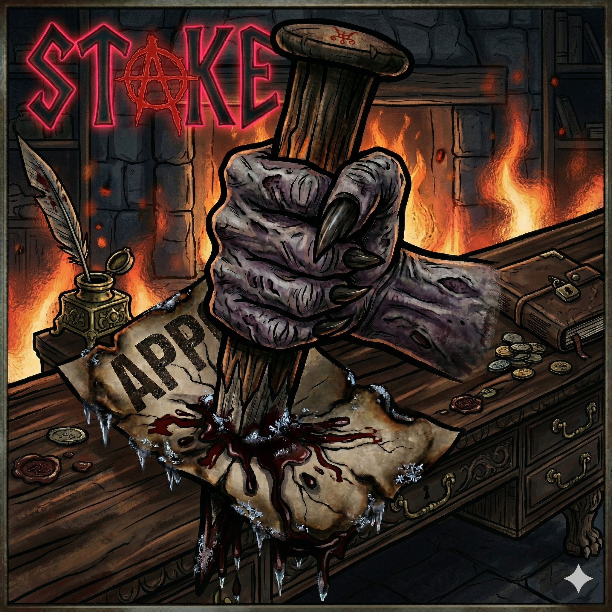

# <p align="center"></p>
# <p align="center">S T A K E</p>
<p align="center">
  <strong>Stake web apps to your desktop</strong>
</p>

<p align="center">
  
  
  
</p>

---

## 🩸 Overview

**Stake** is a high-performance, premium-themed Rust/egui desktop application that serves as a custom-designed GUI wrapper around [`pake`](https://github.com/tw93/pake). 

Specifically crafted and optimized to match the gothic and sleek aesthetic of **Lilith Linux**, Stake allows you to instantaneously turn any web page into a native, ultra-lightweight desktop application with a single click.

<p align="center">
  
</p>

---

## ⚡ Features

- **Instant App Forging**: Enter any website URL and a custom app name to build a lightweight desktop app.
- **Ultra-Lightweight**: Built on top of Rust and Pake, resulting in packages that are up to **40x smaller** than standard Electron apps.
- **Lilith Linux Native**: Designed from the ground up to match the visual language, typography (featuring the Creepster gothic font), and premium dark aesthetic of Lilith Linux.
- **Dual Packaging Options**: Easily generate native `.deb` installers or highly portable `.AppImage` packages.

---

## 🛠️ Installation & Setup

Stake requires `pake-cli` to forge web apps into native desktop apps.

### Prerequisites

```bash
# Install pake-cli (requires Node.js / npm)
npm install -g pake-cli
```

### From Source (Recommended)

```bash
# Install build dependencies + clone
sudo apt install -y pkg-config libxkbcommon-dev libssl-dev build-essential

git clone https://github.com/BlancoBAM/Stake.git
cd Stake

# Run the install script (builds, installs binary + desktop entry)
bash install.sh
```

### Binary Download

Download the pre-built binary from the [Releases page](https://github.com/BlancoBAM/Stake/releases/latest):

```bash
wget https://github.com/BlancoBAM/Stake/releases/latest/download/stake-linux-amd64
sudo install -m 0755 stake-linux-amd64 /usr/local/bin/stake
```

> **Note:** AppImage releases are not currently supported.

---

## 📦 Packaging

### Build Debian Package (`.deb`)

```bash
./scripts/build-deb.sh
```
*Output: `target/debian/stake_*.deb`*

---

## 🖤 Credits & Appreciation

- **Pake**: Deep appreciation and gratitude to [tw93/pake](https://github.com/tw93/pake) for creating the phenomenal, lightweight web-app compiler that powers Stake's backend under the hood.
- **Lilith Linux**: Custom-crafted with devotion to match the dark and gothic desktop environments of Lilith Linux.

---
<p align="center">
  <i>Stake web apps to your desktop.</i>
</p>
